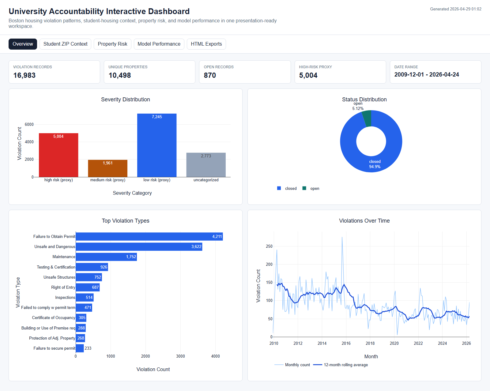
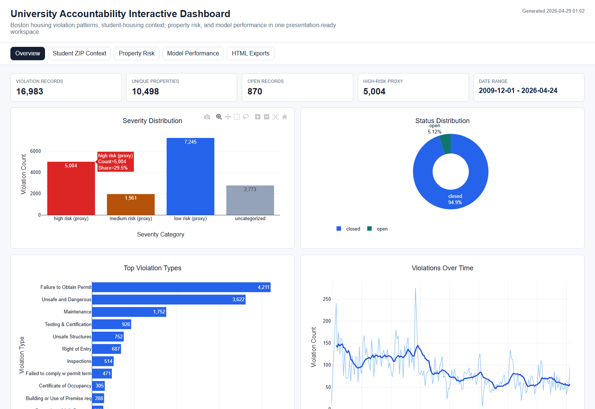
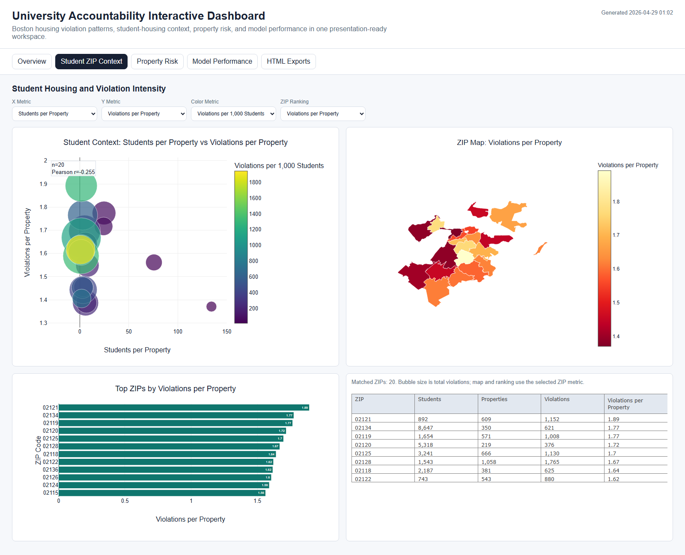
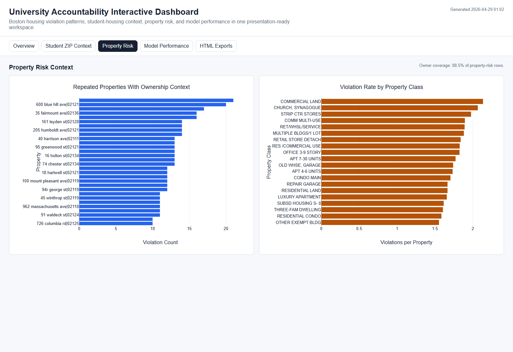
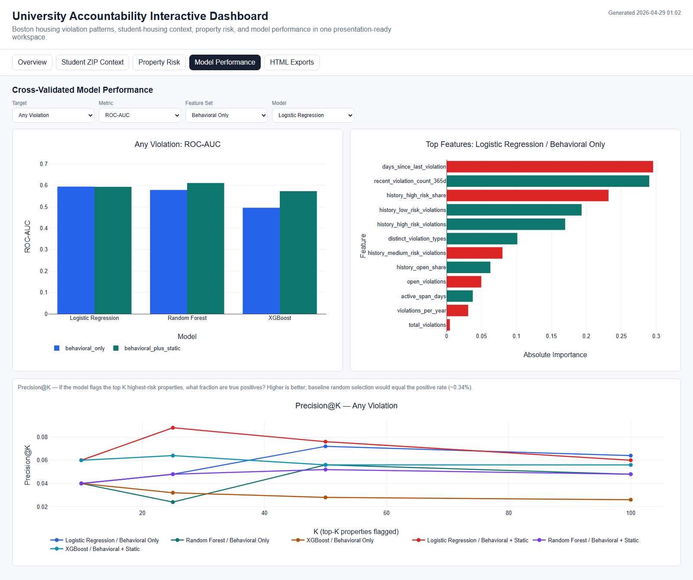
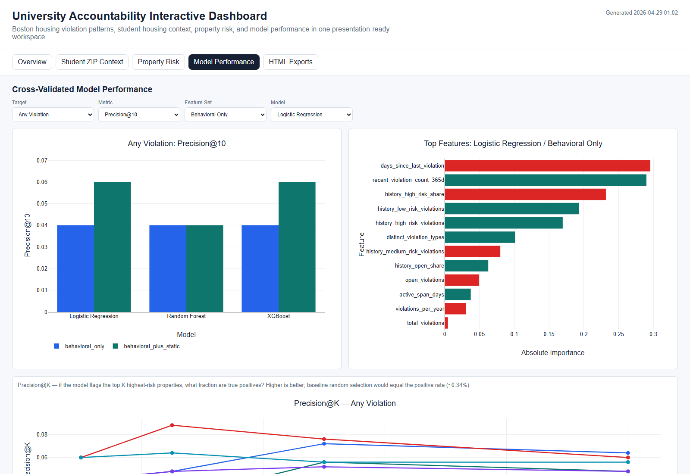
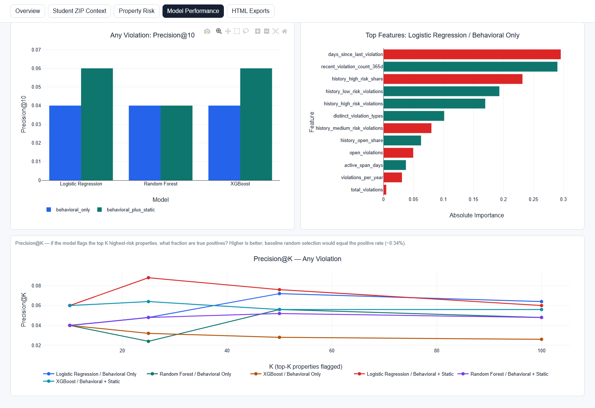
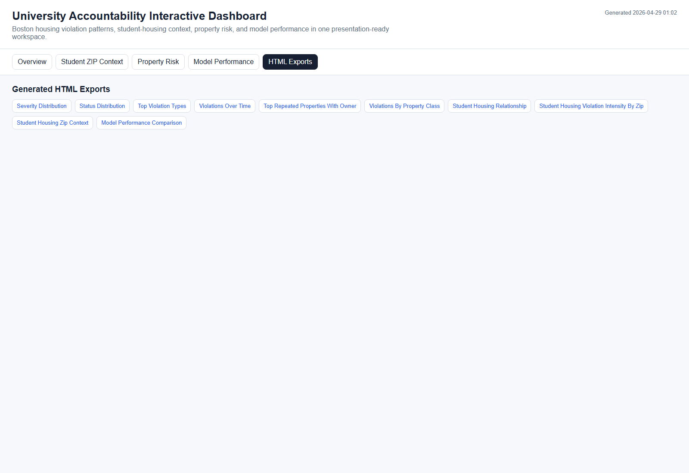

# Interactive Visualization Website Presentation Guide
# 交互式可视化网页演示讲稿

This document explains how to present and use the interactive visualization dashboard in this project. It is written as a bilingual presentation guide, with Chinese explanations first and English speaker notes second.

本文档用于讲解本项目中的交互式可视化网页。内容按 presentation 顺序组织，每一部分都包含中文说明、英文对照讲稿和对应截图。

Dashboard entry point / 网页入口:

```text
outputs/interactive/index.html
```

Regenerate command / 重新生成命令:

```bash
make interactive-viz
```

Screenshot set / 截图位置:

```text
outputs/interactive/presentation_assets/
```

---

## Slide 1. What This Dashboard Is
## 第 1 页：这个 Dashboard 是什么



### 中文讲解

这个交互式可视化网页是本项目的主展示入口。它把 Boston housing violation 数据、学生住房 ZIP context、房产风险分析和模型表现放在同一个可交互页面里，适合用于最终报告展示和现场演示。

顶部有五个主要页签：

- `Overview`: 总体违规记录、严重程度、状态、违规类型和时间趋势。
- `Student ZIP Context`: 学生住房密度和违规强度之间的关系。
- `Property Risk`: 重复违规房产和不同房产类别的违规率。
- `Model Performance`: 预测模型的交叉验证表现、重要特征和 Precision@K。
- `HTML Exports`: 单独导出的交互图表入口。

这一页可以先告诉观众：我们不是只做静态图，而是把数据探索、风险识别和模型评估做成了一个 presentation-ready workspace。

### English speaker notes

This dashboard is the main interactive presentation layer for the project. It combines Boston housing violation records, student housing ZIP-level context, property risk analysis, and predictive model performance in one browser-based workspace.

The page is organized into five tabs: Overview, Student ZIP Context, Property Risk, Model Performance, and HTML Exports. The purpose is not just to show static figures, but to let the audience explore the main findings through filters, hover details, rankings, maps, and model comparison charts.

---

## Slide 2. Overview Tab: Big Picture Metrics
## 第 2 页：Overview 总览页


### 中文讲解

Overview 页是整个项目的摘要页。最上方的 KPI cards 给出数据规模和基本状态：

| Metric | 中文解释 | Value |
|---|---|---:|
| Violation Records | 总违规记录数 | 16,983 |
| Unique Properties | 涉及的唯一房产数 | 10,498 |
| Open Records | 当前仍 open 的记录数 | 870 |
| High-Risk Proxy | 高风险代理类别记录数 | 5,004 |
| Date Range | 数据覆盖时间 | 2009-12-01 to 2026-04-24 |

下面四张图分别回答四个问题：

- `Severity Distribution`: 违规严重程度如何分布。
- `Status Distribution`: open 和 closed 的占比。
- `Top Violation Types`: 哪些违规类型最多。
- `Violations Over Time`: 违规数量随时间如何变化。

从截图中可以看到，`low risk (proxy)` 是数量最多的一类，有 7,245 条；`high risk (proxy)` 有 5,004 条，占比约 29.5%。状态分布中 closed 占 94.9%，open 占 5.12%。

### English speaker notes

The Overview tab gives the audience a high-level understanding of the dataset. It starts with five KPI cards: the total number of violation records, the number of unique properties, the number of open records, the number of high-risk proxy records, and the date range covered by the data.

The four charts below the KPIs summarize severity, status, violation type, and time trend. For example, the low-risk proxy category has the largest count, while the high-risk proxy category still accounts for about 29.5 percent of the records. The status chart shows that most records are closed, while a smaller but still important group remains open.

---

## Slide 3. Hover Interaction and Plotly Controls
## 第 3 页：鼠标悬停和 Plotly 交互



### 中文讲解

这个网页中的图表都是 Plotly 交互图。最常用的操作是把鼠标放到图形元素上查看 tooltip。

例如在 `Severity Distribution` 图中，鼠标悬停在红色柱子上会显示：

- 类别：`high risk (proxy)`
- Count: 5,004
- Share: 29.5%

图表右上角还会出现 Plotly modebar。常见功能包括：

- 下载当前图为 PNG。
- 放大、缩小。
- 框选局部区域。
- 平移视图。
- 自动缩放。
- 重置坐标轴。

演示时可以强调：这些交互让观众不用离开网页，就能查看精确数值和局部趋势。

### English speaker notes

All major charts in the dashboard are interactive Plotly charts. The most common interaction is hover. When the user hovers over a bar, point, map region, or line, the chart shows a tooltip with exact values.

In this example, hovering over the high-risk proxy bar shows the category, count, and percentage share. Plotly also provides a modebar in the top-right corner of each chart, with options such as download, zoom, pan, autoscale, and reset axes. This makes the dashboard useful for both presentation and exploratory analysis.

---

## Slide 4. Student ZIP Context: What It Shows
## 第 4 页：Student ZIP Context 学生住房 ZIP 分析



### 中文讲解

这个页签分析学生住房集中度和违规强度之间的关系。它是项目里最适合讲 policy relevance 的页面，因为它把学生住房、ZIP、违规记录和地图放在一起。

页面上方有四个下拉菜单：

| Control | 中文说明 | Example in screenshot |
|---|---|---|
| X Metric | 选择散点图横轴 | Students per Property |
| Y Metric | 选择散点图纵轴 | Violations per Property |
| Color Metric | 选择气泡颜色代表的指标 | Violations per 1,000 Students |
| ZIP Ranking | 选择排名图和地图的排序指标 | Violations per Property |

左上角散点图中：

- 每个点代表一个 ZIP code。
- 横轴是每个房产对应的学生数。
- 纵轴是每个房产的违规数。
- 气泡大小代表 total violations。
- 颜色代表每 1,000 名学生对应的违规数。

右上角是 ZIP 地图。颜色越浅或越高，代表当前选择指标的值越高。下方的 ranking chart 和 table 列出 top ZIPs，方便观众从图形回到具体 ZIP code。

当前截图中，样本有 20 个匹配 ZIP，散点图显示 Pearson r = -0.255。这说明在这个 ZIP-level 聚合视角下，`Students per Property` 和 `Violations per Property` 之间没有明显的正相关关系。这个结果适合谨慎表述：学生住房多的区域不一定自动意味着每个房产违规率更高。

### English speaker notes

The Student ZIP Context tab connects student housing concentration with violation intensity at the ZIP-code level. This is one of the most policy-relevant views because it combines student housing metrics, violation outcomes, rankings, and a map.

The four dropdowns let the presenter change the scatterplot axes, the color metric, and the ZIP ranking metric. In the default view, each bubble represents a ZIP code. Bubble size reflects total violations, while color reflects violations per 1,000 students.

The map and ranking chart use the selected ZIP ranking metric. In the screenshot, the dashboard matches 20 ZIP codes, and the scatterplot reports a Pearson correlation of -0.255. This suggests that, at this aggregate ZIP level, higher students per property does not automatically translate into higher violations per property.

---

## Slide 5. How To Use Student ZIP Context Live
## 第 5 页：现场演示 Student ZIP Context 的方法


### 中文讲解

现场演示时，可以按这个顺序操作：

1. 先看散点图，解释每个点是一个 ZIP。
2. 指出气泡大小代表 total violations。
3. 改变 `Color Metric`，让观众看到颜色含义可以切换。
4. 改变 `ZIP Ranking`，观察地图、排名图和表格会同步更新。
5. 鼠标悬停在某个 ZIP 上，显示该 ZIP 的 students、properties、violations 和当前指标。

这个页面的价值是“同一组数据可以从多个角度切换”。例如：

- 如果想看学生集中度，用 `Students per Property`。
- 如果想看违规密度，用 `Violations per Property`。
- 如果想对学生人口规模标准化，用 `Violations per 1,000 Students`。
- 如果想找优先关注区域，看 ranking chart 和 table。

### English speaker notes

In a live demo, start with the scatterplot and explain that each point is a ZIP code. Then explain that bubble size represents total violations. After that, change the color metric or ranking metric to show that the dashboard can reframe the same data from different analytical angles.

The key message is that the dashboard supports flexible comparison. Students per property captures student concentration, violations per property captures property-level intensity, and violations per 1,000 students standardizes by student population. The ranking chart and table help translate the visual pattern into concrete ZIP codes.

---

## Slide 6. Property Risk Context
## 第 6 页：Property Risk 房产风险分析



### 中文讲解

Property Risk 页用于识别高风险房产和高风险房产类别。

左边的图是 `Repeated Properties With Ownership Context`。它展示违规次数最高的具体房产。这里不是看 ZIP 的整体情况，而是直接定位到 property level。适合回答：

- 哪些房产重复出现违规？
- 是否存在少数房产贡献了大量问题？
- 后续如果要做 inspection prioritization，应该优先关注哪些地址？

右边的图是 `Violation Rate by Property Class`。它不是简单看总违规数，而是看每个 property class 的 `violations per property`。这样可以避免大类房产因为数量多而自然产生更多违规记录。

右上角的 `Owner coverage: 88.5%` 表示 property-risk rows 中有业主信息覆盖的比例。演示时可以说明：owner coverage 越高，越有利于把风险分析和 accountability 机制连接起来。

### English speaker notes

The Property Risk tab shifts the analysis from ZIP-level patterns to property-level prioritization. The left chart shows repeated properties with high violation counts, while the right chart compares violation rates across property classes.

This view is useful for accountability because it helps identify specific properties or property classes that may require more attention. The owner coverage note indicates how much of the property-risk table has owner information available. Higher owner coverage makes the analysis more actionable for enforcement or follow-up.

---

## Slide 7. Model Performance Overview
## 第 7 页：Model Performance 模型表现总览



### 中文讲解

Model Performance 页用来展示预测模型的交叉验证结果。上方四个下拉菜单控制模型比较方式：

| Control | 中文说明 | Example |
|---|---|---|
| Target | 预测目标 | Any Violation |
| Metric | 评估指标 | ROC-AUC |
| Feature Set | 特征组合 | Behavioral Only |
| Model | 用于右侧特征重要性图 | Logistic Regression |

左侧柱状图比较不同模型和不同 feature set 的表现。截图中显示的是 `Any Violation: ROC-AUC`。ROC-AUC 衡量模型区分正例和负例的能力，越高越好，但它不是“准确率”。

右侧图是 feature importance。当前选择的是 `Logistic Regression / Behavioral Only`，所以右侧显示这个模型和特征组合下最重要的变量。例如：

- `days_since_last_violation`
- `recent_violation_count_365d`
- `history_high_risk_share`
- `history_low_risk_violations`

这些变量说明模型主要依赖历史违规行为和近期违规记录来判断未来风险。

### English speaker notes

The Model Performance tab summarizes cross-validated predictive model results. The user can select the prediction target, evaluation metric, feature set, and model.

The left chart compares model performance across model types and feature sets. In the screenshot, the selected metric is ROC-AUC for the Any Violation target. ROC-AUC measures ranking and discrimination ability; it should not be described as simple accuracy.

The right chart shows feature importance for the selected model and feature set. In this example, the most important features are mostly historical and behavioral variables, such as days since last violation and recent violation count.

---

## Slide 8. Precision@10: What It Means
## 第 8 页：Precision@10 是什么意思



### 中文讲解

`Precision@10` 的意思是：模型把所有房产按预测风险从高到低排序后，只看前 10 个最高风险房产，其中有多少比例是真正的正例。

公式：

```text
Precision@10 = true positives among top 10 flagged properties / 10
```

中文解释：

```text
如果模型标记出风险最高的 10 个房产，
其中有 1 个后来真的发生目标事件，
那么 Precision@10 = 1 / 10 = 0.10
```

在本项目中，它适合解释为 inspection prioritization 指标：

```text
如果监管方只能优先检查 10 个房产，
模型给出的前 10 个名单有多准？
```

截图中 `Any Violation` 目标下，一些模型的 Precision@10 大约是 0.04 到 0.06。意思是平均每 10 个重点标记房产里，大约命中 0.4 到 0.6 个真实正例。

注意：这个指标要和 base rate 对比。对于 `Any Violation`，当前结果表中的 positive class rate 是 2.74%。对于 `High Risk Violation`，positive class rate 约是 0.34%。所以讲解时要说明当前选择的 target 是什么。

### English speaker notes

Precision@10 measures the quality of the model's top 10 risk-ranked properties. The model ranks all properties by predicted risk, and Precision@10 asks what fraction of the top 10 are true positives.

This is especially useful for inspection prioritization. If the city can only inspect a small number of properties first, Precision@10 tells us how reliable the top of the model's priority list is.

In the screenshot, for the Any Violation target, Precision@10 is around 0.04 to 0.06 for several model and feature-set combinations. This should be compared against the target's base positive rate. For Any Violation, the positive class rate is about 2.74 percent; for High Risk Violation, it is about 0.34 percent.

---

## Slide 9. Precision@K Curve
## 第 9 页：Precision@K 曲线



### 中文讲解

`Precision@K` 把 `K` 从 10 扩展到多个取值，比如 10、25、50、100。它回答的问题是：

```text
如果我们检查模型排名前 K 的房产，命中率是多少？
```

横轴是 K，也就是被标记的 top-K 房产数量。纵轴是 Precision@K。曲线越高，表示模型的优先名单质量越好。

这张图适合讲 tradeoff：

- K 很小的时候，名单更集中，但可能不稳定。
- K 变大时，覆盖范围更广，但 precision 可能下降。
- 如果某条曲线一直高于其他曲线，说明该模型和特征组合更适合做 prioritization。

演示时可以强调：传统指标如 ROC-AUC 看整体排序能力，而 Precision@K 更贴近实际使用场景，因为政策执行通常只能优先处理有限数量的房产。

### English speaker notes

Precision@K generalizes Precision@10 by evaluating the model's top-ranked properties at different K values, such as 10, 25, 50, and 100.

The x-axis is the number of top-risk properties flagged by the model, and the y-axis is the fraction of those properties that are true positives. This is more operational than ROC-AUC because real enforcement or inspection workflows often have limited capacity.

The main tradeoff is coverage versus precision. A smaller K gives a more selective list, while a larger K covers more properties but may reduce hit rate.

---

## Slide 10. HTML Exports
## 第 10 页：HTML Exports 单图导出



### 中文讲解

`HTML Exports` 页提供所有单独交互图的入口。每个按钮对应一个独立 HTML 文件，可以单独打开、展示或嵌入报告材料。

可用导出包括：

- `Severity Distribution`
- `Status Distribution`
- `Top Violation Types`
- `Violations Over Time`
- `Top Repeated Properties With Owner`
- `Violations By Property Class`
- `Student Housing Relationship`
- `Student Housing Violation Intensity By Zip`
- `Student Housing Zip Context`
- `Model Performance Comparison`

如果 presentation 中只想展示一张图，而不想打开整个 dashboard，可以从这里进入单图页面。

### English speaker notes

The HTML Exports tab links to standalone interactive chart files. This is useful when the presenter wants to show a single chart without navigating through the full dashboard.

Each exported chart is still interactive because it is saved as a Plotly HTML file. These files can be opened directly in a browser or referenced separately in presentation materials.

---

## Slide 11. Suggested Presentation Flow
## 第 11 页：推荐演示顺序

### 中文讲解

推荐的演示顺序如下：

1. 用 `Overview` 说明数据规模和整体趋势。
2. 用 hover tooltip 展示交互能力。
3. 切到 `Student ZIP Context`，讲学生住房和违规强度的 ZIP-level 关系。
4. 切到 `Property Risk`，从区域层面下钻到具体房产和房产类型。
5. 切到 `Model Performance`，说明模型如何预测未来风险。
6. 重点解释 `Precision@10` 和 `Precision@K`，把模型指标连接到实际 inspection prioritization。
7. 最后展示 `HTML Exports`，说明所有图都可以单独打开和复用。

### English speaker notes

A clear presentation sequence is to start with the overall data summary, then demonstrate interactivity, then move from ZIP-level context to property-level risk, and finally explain model performance and operational prioritization.

The key narrative is: first, we understand the data; second, we identify spatial and property-level risk patterns; third, we evaluate whether models can help prioritize future inspection or accountability efforts.

---

## Slide 12. Key Takeaways
## 第 12 页：核心结论

### 中文总结

可以用下面三句话收尾：

1. 这个 dashboard 把 housing violation、student housing context、property risk 和 model evaluation 放在一个统一的交互式网页里。
2. ZIP-level 分析帮助我们比较不同学生住房区域的违规强度，但结果需要谨慎解释，不能简单说学生越多违规越多。
3. 模型部分不只是看 ROC-AUC，还通过 Precision@K 连接到现实中的有限检查资源分配问题。

### English closing notes

This dashboard brings together housing violations, student housing context, property-level risk, and model evaluation in a single interactive workspace.

The ZIP-level analysis helps compare student housing concentration with violation intensity, but the relationship should be interpreted carefully rather than treated as a simple causal claim.

The model section goes beyond general performance metrics by using Precision@K, which connects predictive modeling to real-world prioritization under limited inspection capacity.

